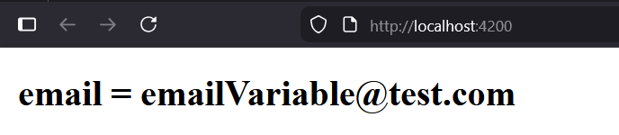

# EnsetApp

This project was generated using [Angular CLI](https://github.com/angular/angular-cli) version 21.2.8.

## The composont of a project Angular

### package.json: 
`package.json`: has the list of the libraries of the project.
```bat
run npm install
```
to install the list of the libraries you have in the file.

```bat
run npm install bootstrap
```
to install only bootstrap and add it to the `package.json`

### node_modules:
`node_modules`: has all the libraries of the project. <br>
note : no need to push it to github, only `package.json` is enough.

### angular.json:
`angular.json`: has the setting of the project like the style and other settings.
you can add setting like this on it to use bootstrap.
```json
"styles": [
    "src/styles.css",
    "node_module/bootstrap/dist/css/bootstrap.min.css"
]
```
## src/:
`src/` containes the project it self, it is a single page application (meaning one index that gonna render at the begining).

## src/main.ts:
`main.ts` is the first file gonna execute after index.html and charge the application, it charges the module app.module.ts, and this shows the app component.
<br>
the view is app.html, and the model that has variables is app.ts.<br>
you declare variables here:
```ts
export class App {
  protected readonly title = signal('enset-app');
  email: string = "emailVariable@test.com"
}
```
## app.ts
in `app.ts` it has to parts :
```ts
@Component({
  selector: 'app-root',
  imports: [RouterOutlet],
  templateUrl: './app.html',
  styleUrl: './app.css',
  standalone: true
})
```
`@Component` is a decorator, just like anotation in springboot.<br>
`selector` : is the name you going to use to call it in the view `app.html`.
```html
<app-root></app-root>
```
`templatetUrl`: is where the view part, app.html.<br>
`styleUrl`: path of the css of that component.<br>
<br>
second part : 
```ts
export class App {
  protected readonly title = signal('enset-app');
  email: string = "emailVariable@test.com"
}
```
where we declare the variables.
<br> to show the variables like email in app.html
```html
<h1>{{email}}</h1>
```



## Development server

To start a local development server, run:

```bash
ng serve
```

Once the server is running, open your browser and navigate to `http://localhost:4200/`. The application will automatically reload whenever you modify any of the source files.

## Code scaffolding

Angular CLI includes powerful code scaffolding tools. To generate a new component, run:

```bash
ng generate component component-name
```

For a complete list of available schematics (such as `components`, `directives`, or `pipes`), run:

```bash
ng generate --help
```

## Building

To build the project run:

```bash
ng build
```

This will compile your project and store the build artifacts in the `dist/` directory. By default, the production build optimizes your application for performance and speed.

## Running unit tests

To execute unit tests with the [Vitest](https://vitest.dev/) test runner, use the following command:

```bash
ng test
```

## Running end-to-end tests

For end-to-end (e2e) testing, run:

```bash
ng e2e
```

Angular CLI does not come with an end-to-end testing framework by default. You can choose one that suits your needs.

## Additional Resources

For more information on using the Angular CLI, including detailed command references, visit the [Angular CLI Overview and Command Reference](https://angular.dev/tools/cli) page.
