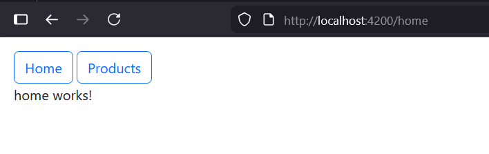
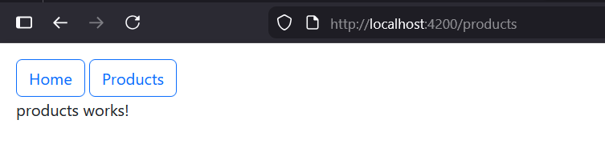

# EnsetApp

This project was generated using [Angular CLI](https://github.com/angular/angular-cli) version 21.2.8.

## The composont of a project Angular

### package.json: 
`package.json`: has the list of the libraries of the project.
```bat
run npm install
```
to install the list of the libraries you have in the file.

```bat
run npm install bootstrap
```
to install only bootstrap and add it to the `package.json`

### node_modules:
`node_modules`: has all the libraries of the project. <br>
note : no need to push it to github, only `package.json` is enough.

### angular.json:
`angular.json`: has the setting of the project like the style and other settings.
you can add setting like this on it to use bootstrap.
```json
"styles": [
    "src/styles.css",
    "node_module/bootstrap/dist/css/bootstrap.min.css"
]
```
## src/:
`src/` containes the project it self, it is a single page application (meaning one index that gonna render at the begining).

## src/main.ts:
`main.ts` is the first file gonna execute after index.html and charge the application, it charges the module app.module.ts, and this shows the app component.
<br>
the view is app.html, and the model that has variables is app.ts.<br>
you declare variables here:
```ts
export class App {
  protected readonly title = signal('enset-app');
  email: string = "emailVariable@test.com"
}
```
## app.ts
in `app.ts` it has to parts :
```ts
@Component({
  selector: 'app-root',
  imports: [RouterOutlet],
  templateUrl: './app.html',
  styleUrl: './app.css',
  standalone: true
})
```
`@Component` is a decorator, just like anotation in springboot.<br>
`selector` : is the name you going to use to call it in the view `app.html`.
```html
<app-root></app-root>
```
`templatetUrl`: is where the view part, app.html.<br>
`styleUrl`: path of the css of that component.<br>
<br>
second part : 
```ts
export class App {
  protected readonly title = signal('enset-app');
  email: string = "emailVariable@test.com"
}
```
where we declare the variables.
<br> to show the variables like email in app.html
```html
<h1>{{email}}</h1>
```
<br>
`app.spec.ts`: for tests unitaires.<br>
by using
```bash
ng test
```
# Craetion of a web component
run : 
```bash
ng g c home
```
`g` : generate<br>
`c` : component<br>
`home` : name of the component.<br>
it gonna create home folder on app folder that has
```bash
CREATE src/app/home/home.spec.ts (540 bytes)
CREATE src/app/home/home.ts (189 bytes)
CREATE src/app/home/home.css (0 bytes)
CREATE src/app/home/home.html (20 bytes)
```

to work with bootstrap there is two ways the first one is the one that mentioned before 
```json
"styles": [
    "src/styles.css",
    "node_module/bootstrap/dist/css/bootstrap.min.css"
]
```
or go to `style.css` next to `index.html` and add
```css
@import "bootstrap/dist/css/bootstrap.min.css";
``` 
after that we add edit app.html
```html
<div class="p-3">
    <nav>
        <button class="btn btn-outline-primary">Home</button>
        <button class="ms-1 btn btn-outline-primary">Products</button>
    </nav>
</div>
```
after we add that we need a routing system. and here where the file `app.routes.ts` comes.
```ts
export const routes: Routes = [
    {path : "home", component : Home},
    {path : "products", component : Products}
];
```
`path` is the route.<br>
`component` is the component that gonna load at that root.<br>
after you can use the routing by in the html :
```html
<nav>
    <button routerLink="/home" class="btn btn-outline-primary">Home</button>
    <button routerLink="/products" class="ms-1 btn btn-outline-primary">Products</button>
</nav>
<router-outlet></router-outlet>
```
`routerLink` you define on it the routing and also you have to add it `app.ts` in the imports
```ts
@Component({
  selector: 'app-root',
  imports: [RouterOutlet, RouterLink],
  templateUrl: './app.html',
  styleUrl: './app.css',
  standalone: true
})
```
`router-outlet` is like the screen where the component gonna be displayed.



---
Now we are going to add products to the products component.<br>
we addd the products in products.ts
```ts
export class Products {
  products = [
    {id: 1, name: "Computer", price: 2300, selected: true },
    {id: 2, name: "Printer", price: 1200, selected: true },
    {id: 3, name: "Smart phone", price: 1300, selected: true }
  ]
}
```

## Loop :

there is two ways to show the data :<br>
#### 1 =
```html
<tbody>
<tr *ngFor="let p of products">
    <td>{{p.id}}</td>
    <td>{{p.name}}</td>
    <td>{{p.price}}</td>
    <td>{{p.selected}}</td>
  </tr>
</tbody>
```
note you should import `ngFor` in `products.ts`.
```ts
import { NgForOf } from '@angular/common';
@Component({
  selector: 'app-products',
  imports: [NgForOf],
  templateUrl: './products.html',
  styleUrl: './products.css',
  standalone: true
})
```
#### 2 =
```html
<tbody>
    @for(p of products; track p) {
        <tr>
        <!-- <tr *ngFor="let p of products"> -->
            <td>{{p.id}}</td>
            <td>{{p.name}}</td>
            <td>{{p.price}}</td>
            <td>{{p.selected}}</td>
        </tr>
    }
</tbody>
```
[4](pics/4.png)<br>
Now we use defferent approches for the products, angular works with the injection of the dependencies
```ts
export class Products implements OnInit {
  products : Array<any>;
  constructor() {

  }
  ngOnInit(): void {
    this.products = [
      {id: 1, name: "Computer", price: 2300, selected: true },
      {id: 2, name: "Printer", price: 1200, selected: true },
      {id: 3, name: "Smart phone", price: 1300, selected: true }
    ]
  }
}
```

## Condition

the condition in angular there are two
```html
 <tbody *ngIf="products">
    @for(p of products; track p) {
        <tr>
        <!-- <tr *ngFor="let p of products"> -->
            <td>{{p.id}}</td>
            <td>{{p.name}}</td>
            <td>{{p.price}}</td>
            <td>{{p.selected}}</td>
        </tr>
    }
</tbody>
```
or 
```html
@if (products) {
    <tbody>
    <!-- <tbody *ngIf="products"> -->
        @for(p of products; track p) {
            <tr>
            <!-- <tr *ngFor="let p of products"> -->
                <td>{{p.id}}</td>
                <td>{{p.name}}</td>
                <td>{{p.price}}</td>
                <td>{{p.selected}}</td>
            </tr>
        }
    </tbody>
}
```
Note : you still going to have an error 
```error
Property 'products' has no initializer and is not definitely assigned in the constructor. [plugin angular-compiler]
```
thats because when you specify the type in our case an array `products : Array<any>;` you always need to intianalize or 
make it just any, like `products : any` to avoid the error, or add `!` so angular gonna igonre the insialization of the variable
`products! : Array<any>`<br>
lets add a icons for the selected products
```html
<td>
  @if(p.selected) {
      <i class="bi bi-check-circle"></i>
  } @else {
      <i class="bi bi-x-circle"></i>
  }
</td>
```
note : to make classes `bi bi-check-circle bi-x-circle` (bi : bootstrap icon) you should install bootstrap icons `npm install bootstrap-icons`.<br>
and add it to the `style.css`
```css
@import "bootstrap-icons/font/bootstrap-icons.css";
```

## delete function

`products.html`
```html
<td>
    <button (click)="handelDelete(p)" class="btn btn-outline-danger"><i class="bi bi-trash"></i></button>
</td>
```
`products.ts`
```ts
handelDelete (product: any) {
    let v = confirm("Are you sure");
    if(v) {
      this.products = this.products.filter((p:any) => p.id != product.id);
    }
}
```
[5](pics/5.png)<br>

## Services
services are groupe of components to make the communication more easier, since the components are as trees.<br>
`directive` : are the attributes in the html components like `required` in `<input type="text" required>`, in angular you can customize the directives. => put contraints for data<br>
`Pipes` : use to format data like `{{dateNaissence | date : 'dd/MM/yyyy'}}`, in angular you can set data formats using pipes. => pour formater le donnes.<br>
### Create a service
for services to create a service :
```bash
ng g s services/product
```
g : generate s : serivce<br>
```bash
CREATE src/app/services/product.spec.ts (342 bytes)
CREATE src/app/services/productservice.ts (120 bytes)
```
`services/productservice.ts`
```ts
import { Injectable } from '@angular/core';

@Injectable({
  providedIn: 'root',
})
export class Product {}

```
`providedIn: 'root'` it says that the service is available for everyone.<br>
when we add the products at this service we can access it not only in the products components but also in the other components.<br>
```ts
import { Injectable } from '@angular/core';

@Injectable({
  providedIn: 'root',
})
export class Product {
  products = [
      {id: 1, name: "Computer", price: 2300, selected: true },
      {id: 2, name: "Printer", price: 1200, selected: false },
      {id: 3, name: "Smart phone", price: 1300, selected: true }
  ]
  constructor(){ }

  getAllProducts () {
    return this.products;
  }

  deleteProduct (product: any) {
      let v = confirm("Are you sure");
      if(v) {
        this.products = this.products.filter((p:any) => p.id != product.id);
      }
  }
}
```
so in `porvidedIn` you decide who has acces to that service.<br>

### Inject a service
Now to use the service you should inject it.<br>
In `products/products.ts`

```ts
export class Products implements OnInit {
  products : any;
  constructor(private productService : ProductService) {
    this.productService = productService;
  }
  ngOnInit(): void {
    this.getAllProducts();
  }

  getAllProducts () {
    this.products = this.productService.getAllProducts();
  }
  
  handelDelete (product: any) {
    this.productService.deleteProduct(product);
    this.getAllProducts();
  }
}
```
you add in the constructor

```time
time = 01:43:00
```


